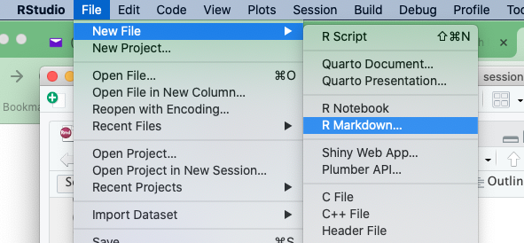
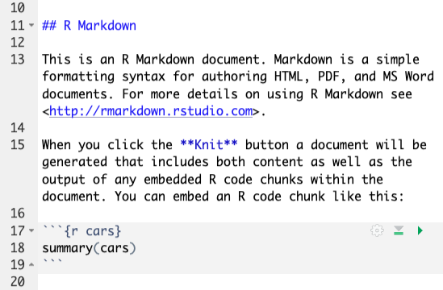
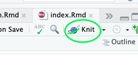

```{r setup, include=FALSE}
options(htmltools.dir.version = FALSE)
knitr::opts_chunk$set(
  fig.width=9, fig.height=3.5, fig.retina=3,
  out.width = "100%",
  cache = FALSE,
  echo = TRUE,
  message = FALSE, 
  warning = FALSE,
  hiline = TRUE
)
```

```{r xaringan-themer, include=FALSE, warning=FALSE}
library(xaringanthemer)
library(dplyr)
style_duo_accent(
  primary_color = "#1381B0",
  secondary_color = "#FF961C",
  inverse_header_color = "#FFFFFF"
)
```

## The pipe operator

- It can be written as %>% or |>

- Makes your code more clear

```{r, eval=FALSE}
mutate(x, y=x+1)
# same as 
x %>% 
  mutate(y=x+1)
# or
x |>
  mutate(y=x+1)

```

- Use a keyboard shortcut to put it in a script! 
- In my mac is Ctrl+Shift m
---
# Why?

- With the pipe operator we can chain multiple functions together.

- Calculate mean total points grouped by playoffs.

.pull-left[

```{r}
nba <- readRDS('./nba.rds')

nba_grouped <- group_by(nba, Playoff) 

nba_summary <- summarize(nba_grouped,
                         avg_pts=mean(PTS))
```
]

.pull-right[

```{r}
nba_summary <- readRDS('./nba.rds') %>% 
  group_by(Playoff) %>% 
  summarize(avg_pts=mean(PTS))
```
]


---
## Rmarkdown

- File format for reports

- It combines R code and text

- It generates documents (pdf, word, html).

---

## Create a file inside your project



---

## Contents


- Line 11 is text (level 2 header).

- Line 15 is regular text.

- Lines 17-19 are R code

---
## Rmarkdown

- R __code chunks__ appear between 3 backticks (`). 

- When we run the file, R runs all the code inside this chunks and puts the output in the final document.

- Ctrl+Shift+i inserts a code chunk.

- Outside the tags, your can use _markdown_


---
## Knit

- Press the knit button to generate the final document (pdf, word or html file).


